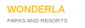

# 🎢 Wonderla - Amusement Park Experience

<div align="center">
  
  
  [](https://nextjs.org/)
  [](https://reactjs.org/)
  [](https://tailwindcss.com/)
  [](https://www.framer.com/motion/)
  [](LICENSE)
</div>

> A modern, interactive web application showcasing Wonderla's thrilling rides across multiple categories with smooth animations and responsive design.

## ✨ Features

### 🎠 **Interactive Ride Categories**
- **Land Rides**: Thrilling roller coasters, drop towers, and spinning rides
- **Water Rides**: Exciting water slides, wave pools, and splash zones  
- **Kids Rides**: Family-friendly attractions designed for young adventurers

### 🎯 **Key Highlights**
- 🖼️ **Optimized Images**: Next.js Image component with lazy loading and WebP support
- 🎨 **Smooth Animations**: Framer Motion for seamless transitions and hover effects
- 📱 **Responsive Design**: Perfect experience across desktop, tablet, and mobile
- 🔄 **Auto-Carousel**: Automatic slide progression with manual controls
- 🎭 **Interactive Cards**: Hover effects with scale transformations and overlays
- 🧭 **Smart Navigation**: Category-based filtering with smooth transitions
- ⚡ **Performance Optimized**: Fast loading with code splitting and optimization

## 🚀 Demo

Visit the live demo: [**Wonderla Experience**](https://wonderla.vercel.app) *(Replace with your actual deployment URL)*

## 🛠️ Tech Stack

| Technology | Purpose | Version |
|------------|---------|---------|
| **Next.js** | React Framework | 15.5.4 |
| **React** | UI Library | 19.1.0 |
| **Tailwind CSS** | Styling | 4.0 |
| **Framer Motion** | Animations | 12.23.22 |
| **Lucide React** | Icons | 0.544.0 |
| **ESLint** | Code Linting | 9.0 |

## 🏗️ Project Structure

```
jaggery/
├── 📁 src/
│   ├── 📁 app/
│   │   ├── 🎨 globals.css
│   │   ├── 🏠 page.js
│   │   ├── 📄 layout.js
│   │   └── 🖼️ favicon.ico
│   ├── 📁 components/
│   │   ├── 🎠 CarouselControls.jsx
│   │   ├── 📋 CategorySidebar.jsx
│   │   ├── 📱 Navbar.jsx
│   │   ├── 🎟️ RideCard.jsx
│   │   └── 🎢 RidesSection.jsx
│   └── 📁 data/
│       ├── 🧭 navbarData.js
│       └── 🎠 ridesData.json
├── 📁 public/
│   ├── 🖼️ wonderla-logo.svg
│   └── 🎨 (other assets)
├── ⚙️ next.config.mjs
├── 🎨 tailwind.config.mjs
└── 📦 package.json
```

## 🚦 Getting Started

### Prerequisites

Make sure you have the following installed:
- **Node.js** (v18.0 or higher)
- **npm** or **yarn** or **pnpm**

### Installation

1. **Clone the repository**
   ```bash
   git clone https://github.com/lalitkumarjangid/wonderla.git
   cd wonderla
   ```

2. **Install dependencies**
   ```bash
   npm install
   # or
   yarn install
   # or
   pnpm install
   ```

3. **Run the development server**
   ```bash
   npm run dev
   # or
   yarn dev
   # or
   pnpm dev
   ```

4. **Open your browser**
   
   Navigate to [http://localhost:3000](http://localhost:3000) to see the application.

### Build for Production

```bash
npm run build
npm start
```

## 🎨 Customization

### Adding New Rides

1. Open `src/data/ridesData.json`
2. Add a new ride object to the appropriate category:

```json
{
  "id": 27,
  "name": "New Exciting Ride",
  "location": "Mumbai",
  "category": "land",
  "description": "An amazing new experience!",
  "image": "https://images.unsplash.com/photo-example",
  "tags": ["Thrilling", "New"]
}
```

### Modifying Categories

Update the categories array in `ridesData.json`:

```json
{
  "id": "adventure",
  "name": "Adventure",
  "icon": "mountain",
  "count": 25,
  "color": "#10b981"
}
```

### Styling Changes

- **Colors**: Modify Tailwind classes in component files
- **Animations**: Adjust Framer Motion properties in components
- **Layout**: Update CSS classes and structure

## 🔧 Configuration

### Environment Variables

Create a `.env.local` file for environment-specific configurations:

```env
NEXT_PUBLIC_API_URL=your_api_url
NEXT_PUBLIC_ANALYTICS_ID=your_analytics_id
```

### Tailwind Configuration

Customize colors, fonts, and other design tokens in `tailwind.config.mjs`:

```javascript
module.exports = {
  theme: {
    extend: {
      colors: {
        wonderla: {
          primary: '#ff6b35',
          secondary: '#004225'
        }
      }
    }
  }
}
```

## 📱 Responsive Design

The application is fully responsive with breakpoints:

- **Mobile**: < 768px
- **Tablet**: 768px - 1024px  
- **Desktop**: > 1024px

Key responsive features:
- Adaptive card layouts
- Collapsible navigation
- Touch-friendly controls
- Optimized image sizes

## ⚡ Performance Features

- **Next.js Image Optimization**: Automatic WebP conversion and lazy loading
- **Code Splitting**: Dynamic imports for optimal bundle sizes
- **CSS Optimization**: Tailwind CSS purging for minimal CSS
- **Caching**: Browser and CDN caching strategies

## 🤝 Contributing

1. **Fork the repository**
2. **Create a feature branch**: `git checkout -b feature/amazing-feature`
3. **Commit your changes**: `git commit -m 'Add amazing feature'`
4. **Push to the branch**: `git push origin feature/amazing-feature`
5. **Open a Pull Request**

### Development Guidelines

- Follow the existing code style
- Add comments for complex logic
- Test responsive design
- Ensure accessibility compliance

## 🐛 Known Issues

- None currently reported

## 📈 Future Enhancements

- [ ] 🎫 Ticket booking system integration
- [ ] 🗺️ Interactive park map
- [ ] 📅 Real-time ride wait times
- [ ] 🎯 Personalized ride recommendations
- [ ] 🌐 Multi-language support
- [ ] 📊 Analytics dashboard
- [ ] 🔔 Push notifications for updates

## 📄 License

This project is licensed under the MIT License - see the [LICENSE](LICENSE) file for details.

## 👨‍💻 Author

**Lalit Kumar Jangid**
- GitHub: [@lalitkumarjangid](https://github.com/lalitkumarjangid)
- LinkedIn: [Lalit Kumar Jangid](https://linkedin.com/in/lalitkumarjangid)

## 🙏 Acknowledgments

- **Wonderla** for inspiration and branding
- **Unsplash** for high-quality ride images
- **Next.js team** for the amazing framework
- **Tailwind CSS** for the utility-first approach
- **Framer Motion** for smooth animations

## 📞 Support

If you have any questions or need help, please:

1. Check the [Issues](https://github.com/lalitkumarjangid/wonderla/issues) page
2. Create a new issue if needed
3. Contact: [your-email@example.com](mailto:your-email@example.com)

---

<div align="center">
  <strong>Made with ❤️ by Lalit Kumar Jangid</strong>
  <br/>
  <em>Bringing the magic of Wonderla to the digital world</em>
</div>
